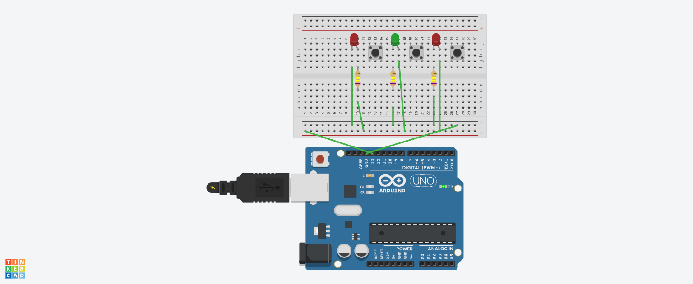

# 💡 Arduino Blink Project with Buttons

This is a simple Arduino project that allows you to control three LEDs using three push buttons. Each button turns its corresponding LED **on** or **off**, simulating a blinking behavior based on real user input.

---

## 🖼️ Circuit Overview

The circuit consists of:
- 3 LEDs connected to digital pins
- 3 push buttons used as digital inputs
- 220Ω resistors for current limiting
- 10kΩ resistors as pull-downs for stable button logic

### 📷 Visual Representation

#### 🔴 LEDs OFF  


#### 🟢 LEDs ON (when buttons pressed)  


---

## 🧰 Components Used

- 1 × Arduino UNO  
- 3 × LEDs (2 red, 1 green)  
- 3 × 220Ω resistors (LEDs)  
- 3 × Push buttons  
- 3 × 10kΩ resistors (pull-down)  
- Breadboard  
- Jumper wires  

---

## 🧠 Project Functionality

- Each button is linked to a specific LED  
- When a button is pressed, the corresponding LED lights up  
- When released, the LED turns off  
- This creates a **real-time blinking effect** based on user interaction

---

## 📄 Arduino Code (Basic Logic)

```cpp
const int ledPins[] = {8, 9, 10};     // LEDs connected to pins 8, 9, 10
const int btnPins[] = {2, 3, 4};      // Buttons connected to pins 2, 3, 4

void setup() {
  for (int i = 0; i < 3; i++) {
    pinMode(ledPins[i], OUTPUT);
    pinMode(btnPins[i], INPUT);
  }
}

void loop() {
  for (int i = 0; i < 3; i++) {
    int btnState = digitalRead(btnPins[i]);
    digitalWrite(ledPins[i], btnState);
  }
}
